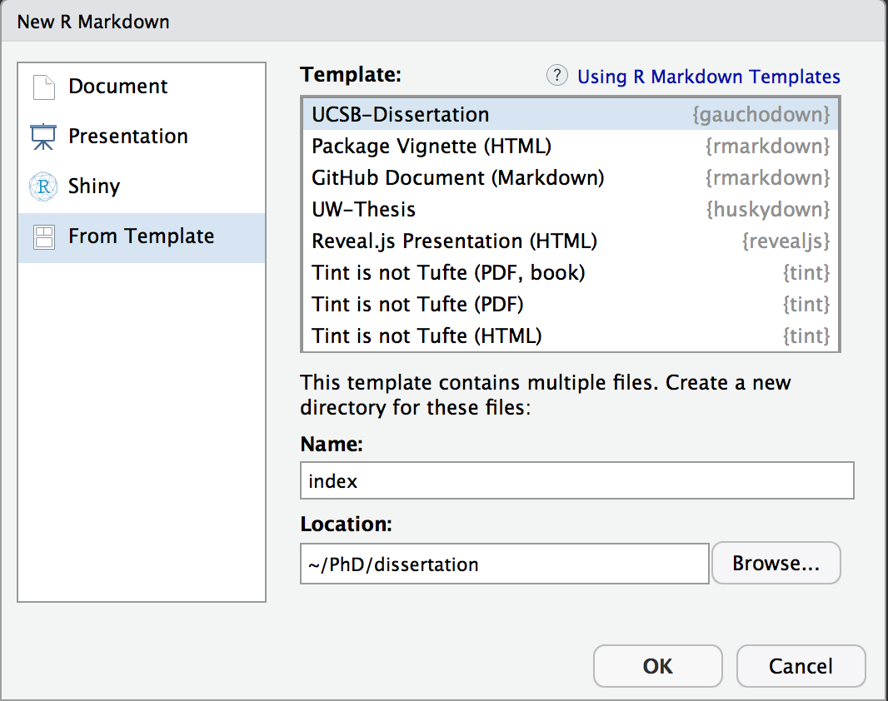
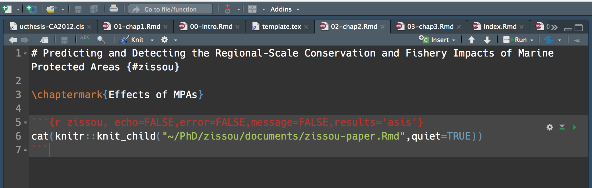

 

# gauchodown 

This project provides a template for writing a PhD dissertation in R Markdown, and rendering those files into a PDF formatted according to [the requirements of the University California, Santa Barbara](http://www.graddiv.ucsb.edu/academic/Filing-Your-Thesis-Dissertation-DMA-Document). It uses the University of California Thesis Class to convert R Markdown files into a PDF formatted ready for submission at UCSB. This package is a more or less direct copy of `huskydown`, with modifications as needed to deal with UCSB's requirements.  Huge thanks to


-[huskydown](https://github.com/benmarwick/huskydown)

-[thesisdown](https://github.com/ismayc/thesisdown) 

-[bookdown](https://github.com/rstudio/bookdown)

Currently, the PDF and gitbook versions are fully-functional, and are the focus of this package. The word and epub versions are in development, have no templates behind them, and are essentially calls to the appropriate functions in bookdown.

If you are new to working with `bookdown` and `rmarkdown`, please read over the documentation available in gauchodown PDF template (which you can create by following the simple instructions below) and the [bookdown book](https://bookdown.org/yihui/bookdown/).

Under the hood, the University of California Dissertation LaTeX template is used to ensure that documents conform precisely to submission standards. At the same time, composition and formatting can be done using lightweight [markdown](http://rmarkdown.rstudio.com/authoring_basics.html) syntax, and **R** code and its output can be seamlessly included using [rmarkdown](http://rmarkdown.rstudio.com).

## Using gauchodown to write your dissertation

### Initial setup

Using **gauchodown** has some prerequisites, such as Pandoc, LaTeX and some fonts. To compile PDF documents using **R**, you need to have Pandoc, LaTeX and several related packages installed. If you have a recent version of  [RStudio](http://www.rstudio.com/products/rstudio/download/), then you already have Pandoc and don't need to do anything more about that. 

Next is LaTeX. By far the easiest way to install LaTeX on any platform is with the [`tinytex`](https://yihui.name/tinytex/) package:

```
install.packages(c('tinytex', 'rmarkdown'))
tinytex::install_tinytex()
# after restarting RStudio, confirm that you have LaTeX with 
tinytex:::is_tinytex()
```

Our PDF template requires some specific fonts, [EB Garamond](https://github.com/georgd/EB-Garamond), [Source Code Pro](https://github.com/adobe-fonts/source-code-pro/) and [Lato](http://www.latofonts.com/lato-free-fonts/). These are included in this repository. You need to install these before proceeding, either by using your usual method of installing fonts, or following these instructions:

On a Linux system here's the simplest way to install the fonts:

```
git clone https://github.com/benmarwick/huskydown
cd huskydown && unzip inst/fonts.zip
cp inst/fonts -r ~/usr/local/share/fonts
sudo fc-cache -f -v
```

On an OSX system you can download a copy of the fonts in this repository with <https://github.com/benmarwick/huskydown/raw/master/inst/fonts.zip>, unzip and move them to your fonts directory, or, assuming [homebrew](https://brew.sh/) is installed and updated, this will get you the fonts needed for this template:

```
brew update
brew tap caskroom/fonts
brew cask install font-eb-garamond font-source-code-pro font-lato
```

On Windows the usual pointing and clicking is required to install the fonts listed above. You can download a copy of the fonts in this repository at <https://github.com/benmarwick/huskydown/raw/master/inst/fonts.zip>, unzip and move them to your fonts directory. 

### Starting to write your thesis

To use `gauchodown` from [RStudio](http://www.rstudio.com/products/rstudio/download/):

1) Ensure that you have already installed LaTeX and the fonts described above, and are using the latest version of [RStudio](http://www.rstudio.com/products/rstudio/download/). You can use `gauchodown` without RStudio. For example, you can write the Rmd files in your favourite text editor (e.g. [Atom](https://atom.io/), [Notepad++](https://notepad-plus-plus.org/)). But RStudio is probably the easiest tool for writing both R code and text in your thesis. 

2) Install the `bookdown` and `gauchodown` packages: 

```
if (!require("devtools")) install.packages("devtools", repos = "http://cran.rstudio.org")
install.packages("bookdown")
devtools::install_github("danovando/gauchodown")
```

3) Use the **New R Markdown** dialog to select **UCSB-Dissertation**, here are the steps, and a screenshot below:

File -> New File -> R Markdown... then choose 'From template', then choose 'UCSB-Dissertation, and enter `index` as the **Name**. Note that this will currently only **Knit** if you name the directory `index` at this step. 



Or if you're not using RStudio, run this line in your R console to create a new PhD dissertation from the template:

```r
rmarkdown::draft('index.Rmd', template = 'UCSB-Dissertation', package = 'gauchodown', create_dir = TRUE)
```

### Starting your first draft

Hopefully now you've got a nice looking repo and your index.Rmd file. The YAML (YAML ain't markup language) material at the start of index.Rmd contains a bunch of metadata for your dissertation. This is where you can enter your name, dissertation title, committee members, abstract, dedication, acknowledgements, etc. 

UCSB's template also has a CV section that includes education and publications. I'm sure there's a way to automate this, but I'm not going to tackle it at this point. For now, to edit this section inside the repo created from your template

1. Open up template.tex

2. Scroll down to the block labeled "CV" (should be around line 147)

3. Modify the education section as needed

4. For the publications, I just exported a bibliogrphy from [Zotero](http://zotero.org/) to my clipboard and pasted it here. The formatting isn't perfect but I'd call it good enough. If someone wants to take a stab at generating a sub-bibliography in this section that would be great!


### Chapter Short Titles

Let's face it, chapter titles are often long (of course to reflect all the amazing research inside). This can create a bit of a mess in the header of your chapters, as "Chapter 1. The Dynamics of Monological Imperatives in *Dick and Jane*: A Study in Phsycic Transrelational Gender Modes" spills over your margins. To that end, you can provide a short title for each chapter that will appear by including `\chaptermark{My Short Title}` below the actual title of each chapter's .Rmd. For example, this template will generate a file called 01-chap1.Rmd. Inside there, the full title of this chapter is `# R Markdown Basics {#rmd-basics}`, and below that I added in a short title called "Basics" by including `\chaptermark{Basics}` in 01-chap1.Rmd. 

 
### Day-to-day writing of your thesis 

You need to edit the individual chapter R Markdown files to write your thesis. 

You can write in the Rmd files without RStudio (in fact RStudio lacks some conveniences for writing, such as live spell-checking and live word count). So you may prefer to do some writing and editing your Rmd files in your favourite text editor. I frequently use [Atom](https://atom.io/), [Notepad++](https://notepad-plus-plus.org/), and [Emacs](https://www.gnu.org/software/emacs/). But I come back to RStudio to create the PDF and work on the R code in my documents. 

While writing, you should `git commit` your work frequently, after every major activity on your thesis. For example, every few paragraphs or section of text, and after major step of analysis development. You should `git push` at the end of each work session before you leave your computer or change task. For gentle novice-friendly guide to getting starting with using Git with R and RStudio, see <http://happygitwithr.com/>.

#### Organizing with `knitr::knit_child`

You can certainly use the same project to house all of the data and code for each of your chapters (and if your analysis runs fast enough you could of course simply do all of your analysis and writing for a chapter in the .Rmd for that chapter). I personally find this to be a bit cumbersome though, and since the end goal of the research in your dissertation isn't the dissertation, but (presumably) papers produced from your dissertation, I preferered to keep each of my chapters in their own projects, which I then knitted together for the final dissertation. Let me explain. 

My dissertation had three chapters. For each chapter, I created a separate RStudio project and folder on my computer, call it "~/PhD/zissou" (I nickname all my projects). Inside that folder I stored the data, code, and paper .Rmd for the `zissou` chapter. When I wanted to actually knit the dissertation, rather than copy-and-pasting all the required results or data from `zissou` over to my `dissertation` folder, I simply used `knit_child` (and some voodoo in the chunk options).




## Rendering

To render your thesis into a PDF, open `index.Rmd` in RStudio and then click the "knit" button. To change the output formats between PDF, gitbook and Word , look at the `output:` field in `index.Rmd`and comment-out the formats you don't want.

Alternatively, if you're not using RStudio, you can use this from the R console, assuming your have set the `'index/` directory as your working directory:

```r
bookdown::render_book('index.Rmd', gauchodown::thesis_pdf(latex_engine = 'xelatex'))
```

The PDF file of your thesis will be deposited in the `_book/` directory.

## Components

The following components are ones you should edit to customize your thesis:

### `_bookdown.yml`

This is the main configuration file for your thesis. It determines what Rmd files are included in the output, and in what order. Arrange the order of your chapters in this file and ensure that the names match the names in your folders. 

### `index.Rmd`

This file contains all the meta information that goes at the beginning of your
document. You'll need to edit this to put your name on the first page, the title of your thesis, etc.

### `01-chap1.Rmd`, `02-chap2.Rmd`, etc.

These are the Rmd files for each chapter in your dissertation. Write your thesis in these. If you're writing in RStudio, you may find the [wordcount addin](https://github.com/benmarwick/wordcountaddin) useful for getting word counts and readability statistics in R markdown documents. You might also enjoy writing in these Rmd files with [Atom](https://atom.io/), [Notepad++](https://notepad-plus-plus.org/), [Sublime Text](https://www.sublimetext.com/), and [Emacs](https://www.gnu.org/software/emacs/). 

### `bib/`

Store your bibliography (as bibtex files) here. We recommend using the [citr addin](https://github.com/crsh/citr) and [Zotero](https://www.zotero.org/) to efficiently manage and insert citations. 

### `csl/`

Specific style files for bibliographies should be stored here. A good source for
citation styles is https://github.com/citation-style-language/styles#readme

### `figure/` and `data/`

Store your figures and data here and reference them in your R Markdown files. See the [bookdown book](https://bookdown.org/yihui/bookdown/) for details on cross-referencing items using R Markdown.

## Related projects

This project has drawn directly on code and ideas in the following:

- https://github.com/UWIT-IAM/UWThesis    
- https://github.com/stevenpollack/ucbthesis  
- https://github.com/suchow/Dissertate    
- https://github.com/SeungkiKwak/Kwak_S_PhD_thesis    
- https://github.com/dhalperi/uwthesis-tweaked     

Other relevant projects:

- Ed Berry's blog post ['Writing your thesis with bookdown'](https://eddjberry.netlify.com/post/writing-your-thesis-with-bookdown/), Posted on September 25, 2017    
- Rosanna van Hespen's ([@rosannavhespen](https://twitter.com/rosannavhespen?lang=en)) five blog posts on ['Writing your thesis with R Markdown'](https://rosannavanhespenresearch.wordpress.com/2016/02/03/writing-your-thesis-with-r-markdown-1-getting-started/)
- [thesisdowndss](https://github.com/mine-cetinkaya-rundel/thesisdowndss) by Mine Cetinkaya-Rundel at Duke University    
- [beaverdown](https://github.com/zkamvar/beaverdown) by Zhian Kamvar at Oregon State University

## Contributing

If you would like to contribute to this project, please start by reading our [Guide to Contributing](CONTRIBUTING.md). Please note that this project is released with a [Contributor Code of Conduct](CONDUCT.md). By participating in this project you agree to abide by its terms.

<!--
To update the PDF template stored in inst/ assuming we are at top level:

rmarkdown::draft('index.Rmd', template = 'thesis', package = 'gauchodown', create_dir = TRUE, edit = FALSE)

setwd('index')

bookdown::render_book('index.Rmd', gauchodown::thesis_pdf(latex_engine = 'xelatex'))

-->

